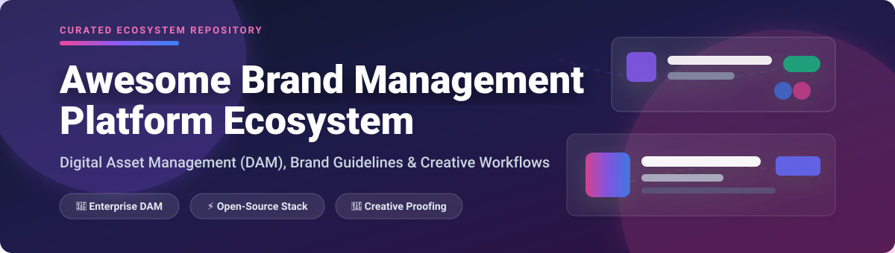

  

# 🚀 Awesome Brand Management Platform Ecosystem 🎨

  
  
  
  
  

---

## 📌 Executive Overview & Market Insights 💡

> **📊 Estimated Sector Market Size:** The global Digital Asset Management (DAM) and Brand Management platform market is valued at **~$6.6 Billion to $7.5 Billion in 2026** and is projected to reach **~$11.9 Billion to $17.1 Billion by 2030**, expanding at a Compound Annual Growth Rate (CAGR) of **14%–16%**.
>
> **🏗️ Market Structure & Dynamics:** The sector is **moderately fragmented**. High-end enterprise DAM operations are anchored by major platforms (Bynder, Acquia, Frontify, Brandfolder), while a vibrant ecosystem of specialized SaaS products (Marq, Filestage, Ziflow) and self-hosted open-source software (Pimcore, ResourceSpace, AtroDAM, Immich) cater to mid-market teams, creative agencies, and developers seeking vendor independence.

---

This curated repository tracks top-tier **SaaS platforms** and **open-source software** for **Brand Asset Management (BAM)**, **Digital Asset Management (DAM)**, **Brand Guidelines**, and **Creative Approval Workflows**. These solutions enable marketing, design, and product teams to centralize, organize, search, proof, and distribute visual brand identity assets (logos, typography, color palettes, templates, photos, and video collateral) while ensuring strict brand consistency across multi-channel campaigns.

---

## 📑 Table of Contents 🔍

- [📊 SaaS & Hosted Brand Management Platforms](#-saas--hosted-brand-management-platforms)
- [💻 Open-Source GitHub Projects](#-open-source-github-projects)
- [🛠️ Developer Frameworks & Tools](#️-developer-frameworks--tools)
- [🤝 How to Contribute](#-how-to-contribute)
- [💖 Support & Sponsorship](#-support--sponsorship)
- [⚖️ Disclaimer & Usage Guidelines](#️-disclaimer--usage-guidelines)
- [📈 Star History](#-star-history)

---

## 📊 SaaS & Hosted Brand Management Platforms 🏢

The SaaS market in brand asset management is sorted below by company scale (estimated valuation / market funding / annual revenue descending).

| Brand Platform | Key Focus & Features | Est. Scale / Revenue / Valuation 📈 | Starting Tier Price 💳 | Free Plan / Free Trial Limit 🎁 |
| :--- | :--- | :--- | :--- | :--- |
| **[Bynder](https://www.bynder.com/)** 👑 | Enterprise DAM platform featuring brand guidelines, automated creative templating, and portal analytics. | **~$150M+ ARR** (Acquired by Thomas H. Lee Partners at ~$600M+ valuation) | **$450 / month** ($5,400/yr starting base tier) | **14-Day Free Trial** (Guided sandbox trial upon request) |
| **[Brandfolder](https://brandfolder.com/)** 📁 | AI-powered digital asset management with smart tagging, brand portals, and creative integrations (by Smartsheet). | **~$100M+ ARR** (Acquired by Smartsheet for $155M) | **$1,000 / month** ($12,000/yr enterprise starting tier) | **14-Day Free Trial** (Sales-assisted evaluation account) |
| **[Acquia DAM](https://www.acquia.com/products/dam)** (Widen) 🏛️ | Enterprise-grade DAM integrated with Drupal CMS for omnichannel asset delivery and governance. | **~$90M+ ARR** (Acquia acquired Widen; Acquia parent Vista Equity) | **$800 / month** ($9,600/yr entry plan) | **14-Day Free Trial** (Interactive demo sandbox available) |
| **[Frontify](https://www.frontify.com/)** 🎨 | All-in-one brand management platform combining DAM, digital brand styleguides, and design templates. | **~$60M+ ARR** ($80M+ total venture funding raised) | **$79 / month** (Essentials tier billed annually) | **14-Day Free Trial** (Full access, no credit card required) |
| **[Canto](https://www.canto.com/)** 🖼️ | Intuitive cloud DAM with facial recognition tagging, custom brand portals, and media rights management. | **~$50M+ ARR** (Backed by Marlin Equity Partners) | **$600 / month** (Billed annually for team tier) | **14-Day Free Trial** (Custom trial account via sales demo) |
| **[MediaValet](https://www.mediavalet.com/)** ☁️ | Enterprise cloud DAM built natively on Microsoft Azure with AI video recognition and security compliance. | **~$35M+ ARR** (Acquired by STG for ~$138M enterprise value) | **$500 / month** ($6,000/yr starting plan) | **14-Day Free Trial** (Guided proof-of-concept trial) |
| **[Ziflow](https://www.ziflow.com/)** ⚡ | Enterprise creative proofing and review platform for managing feedback and version control on brand assets. | **~$22.5M ARR** ($20M+ venture funding raised) | **$199 / month** (Standard tier for up to 15 users) | **Free-Forever Plan** (Up to 2 users, 2GB storage, 60-day review history) |
| **[IntelligenceBank](https://www.intelligencebank.com/)** 🏦 | Marketing operations & DAM platform with built-in brand governance, creative approvals, and compliance controls. | **~$11.5M ARR** (Growth funded by Five V Capital) | **$500 / month** (Base platform tier) | **14-Day Free Trial** (Guided sandbox demo) |
| **[BrandMaker](https://www.brandmaker.com/)** (Uptempo) 📈 | Enterprise marketing operations and asset resource management platform for global multi-brand management. | **~$14M ARR** ($30M+ total funding raised) | **$750 / month** (Enterprise starter module) | **14-Day Free Trial** (Demo sandbox upon sales contact) |
| **[Marq](https://www.marq.com/)** (Lucidpress) ✏️ | Brand templating & design platform enabling non-designers to customize on-brand collateral lock-tight. | **~$10M+ ARR** (Spun out from Lucid Software) | **$10 / user / month** (Pro plan billed annually) | **Free-Forever Plan** (3 active projects limit, 25MB storage) |
| **[Filestage](https://filestage.io/)** 💬 | Collaborative content review and proofing tool for visual marketing collateral and video brand assets. | **~$4M ARR** ($4M+ total venture funding) | **$199 / month** (Flat-rate Starter tier) | **7-Day Free Trial** (Pro features trial) + Free plan (2 active projects) |
| **[Brandworkz](https://www.brandworkz.com/)** 🔐 | Brand asset management and marketing operations software focused on maintaining strict corporate brand identity. | **~$3M ARR** (Acquired by SPINAKR Solutions in 2023) | **$400 / month** (Essentials tier) | **14-Day Free Trial** (Demo trial sandbox upon request) |
| **[BrandMaster](https://www.brandmaster.com/)** 🌐 | Cloud brand management platform to plan, adapt, and distribute marketing assets across global channels. | **~$2.5M ARR** (Operates under Papirfly Group) | **$350 / month** (Starter brand portal) | **14-Day Free Trial** (Trial workspace available) |

---

## 💻 Open-Source GitHub Projects 🔓

Self-hosted open-source Digital Asset Management systems sorted by **GitHub Stars_Count (descending)**.

| Project Name | Badge / Stars_Count ⭐ | Description & Primary Capabilities | License 📜 |
| :--- | :--- | :--- | :--- |
| **[Immich](https://github.com/immich-app/immich)** 🌟 |  | High-performance self-hosted backup, tag management, and photo/video asset management platform with ML face recognition and mobile sync. | AGPL-3.0 |
| **[Paperless-ngx](https://github.com/paperless-ngx/paperless-ngx)** 📄 |  | Community-driven document asset management system with automated OCR, tag indexing, and brand document archiving capabilities. | GPL-3.0 |
| **[Pimcore](https://github.com/pimcore/pimcore)** 📦 |  | Enterprise Open-Source platform combining Digital Asset Management (DAM), PIM, MDM, and CMS. Manages brand collateral alongside product data. | GPL-3.0 |
| **[Mayan EDMS](https://github.com/mayan-edms/mayan-edms)** 🗄️ |  | Open-source electronic document and brand asset management system featuring version control, workflow management, and digital signatures. | Apache-2.0 |
| **[Phraseanet / Phrasea](https://github.com/alchemy-fr/Phraseanet)** 🎞️ |  | PHP/Elasticsearch open-source DAM system for photo, video, audio, and publication asset management with metadata read/write (IPTC/XMP). | GPL-3.0 |
| **[AWS Visual Asset Management System (VAMS)](https://github.com/awslabs/visual-asset-management-system)** ☁️ |  | AWS-native architecture framework for ingesting, transforming, organizing, and distributing 2D, 3D, and high-res media brand assets. | Apache-2.0 |
| **[AtroDAM](https://github.com/atrocore/atrodam)** 🏷️ |  | Enterprise API-centric open-source Digital Asset Management software built on AtroCore with customizable metadata, taxonomy, and asset workflows. | GPL-3.0 |
| **[FreeFrame](https://github.com/Techiebutler/freeframe)** 🎥 |  | Open-source alternative to Frame.io focused on collaborative video proofing, time-coded feedback, and brand asset review. | MIT |
| **[ResourceSpace](https://github.com/resourcespace/resourcespace)** 🏛️ |  | Mature, widely deployed web-based open-source digital asset management system built for non-profits, enterprise, and educational institutions. | BSD-3-Clause |
| **[Damvia](https://github.com/damviaHQ/damvia)** 💾 |  | Lightweight open-source DAM solution that mounts directly on existing Cloud Storage (Dropbox, OneDrive) with automated metadata discovery. | AGPL-3.0 |
| **[UnoPim DAM](https://github.com/unopim/unopim-digital-asset-management)** 🛍️ |  | Laravel-based open-source asset management extension built for the UnoPim ecosystem with media galleries and ffmpeg thumbnailing. | MIT |
| **[Longpoint](https://github.com/longpoint-io/longpoint)** 🧠 |  | API-first, self-hosted media DAM with semantic search, automatic scene classification, and multimodal understanding (Claude/GPT integration). | FSL-1.1-MIT |
| **[Brand Assets Ecosystem](https://github.com/b-ciq/brand-assets-ecosystem)** 🤖 |  | Next.js and MCP server architecture for managing organizational logos and brand identity files consumable by AI agents. | MIT |

---

## 🛠️ Developer Frameworks & Brand Infrastructure Tools 🔧

Specialized open-source tools for defining brand identities as code and managing organizational asset repositories:

- 🧬 **[Brand DNA](https://www.npmjs.com/package/brand-dna)** — An opinionated, open-source source of truth for brand identity structured for AI agents (`brand-dna.json`) and human team members via a public brandbook interface.
- 📐 **[brandspec](https://www.npmjs.com/package/brandspec)** — Define Brand Identity as Code using W3C Design Tokens standards. Exports brand variables (`brand.yaml`) directly to CSS, Tailwind, Figma, and Style Dictionary.
- 🏢 **mcp-tool-shop-org/brand** — Centralized brand asset registry CLI for GitHub organizations to enforce single-source logo integrity across READMEs and documentation.

---

## 🤝 How to Contribute 📝

Contributions are very welcome! If you know of a SaaS platform or open-source repo that should be listed:

1. Fork this repository 🍴.
2. Edit `README.md` following the tabular format and sorting rules (sorted by scale/revenue for SaaS, sorted by stars for open-source) ✏️.
3. Ensure all descriptions are objective, factual, and concise 📌.
4. Create a Pull Request (PR) with a short description of the tool added 🚀.

---

## 💖 Support & Sponsorship ☕

Thank you for exploring the **Awesome Brand Management Platform Ecosystem**! If you find this curated ecosystem list helpful in selecting brand software or building open-source brand infrastructure:

- ⭐ **Star** this repository to help others discover it.
- 🔄 **Share** it with your fellow brand managers, marketers, and developers.
- ☕ **Sponsor** the project or buy us a coffee via our [GitHub Sponsor Dashboard](https://github.sponsors/ishandutta2007). Your support helps maintain and update these open-source ecosystem lists!

---

## ⚖️ Disclaimer & Usage Guidelines 📖

- This project is a **community-curated list** for informational and research purposes only.
- Trademarks, logos, and brand names belong to their respective corporate owners.
- Self-hosting open-source solutions requires appropriate security hardening, storage configuration, and infrastructure maintenance.

---

## 📈 Star History

---

  <b>Made with ❤️ for brand managers, creative directors, growth marketers, and open-source developers.</b>

